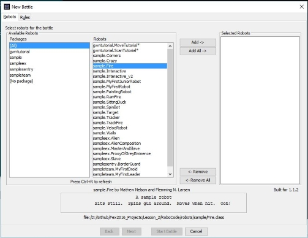
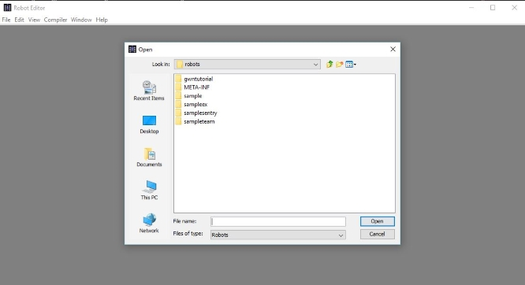

#Lesson 2: Robocode Lesson Plan

Pre-flight instructions:
**Pre-lesson prep**
* Download GWN Fex2016_Projects folder, unzip and save to desktop.
* The folder will contain all the files you need for the Robocode lesson. 
* If the folder is unavailable, you can [download Robocode from the web](http://robocode.sourceforge.net), and run the 'robodode-setup.jar' file.

---
10 - 15 min: 
**Intro to Robocode**   
* Robocode is a programming game where the goal is to code a robot to compete against other robots in a battle arena.
* The player is the programmer of the robot who has no direct influence over the game. Instead, the player must write the Artificial Intelligence (AI) of the robot telling it how to behave and react.

* A robot consists of three individual parts: the **body**, **the gun**, and **the radar**
	
	- The **tank body** carries the gun and the radar on top. It is used for moving the robot forward and back, and turning left or right.
	- The **gun** is mounted on the body and is used for firing energy bullets. The gun can turn left or right.
	- The **radar** is mounted on the gun and is used to scan for other robots while you're moving. The radar can turn left or right.

* Demo a robot battle to show students what gameplay looks like:
	
	- In the 'RoboCode' folder, double-click the 'robocode.bat' file
	- Click the 'Battle' menu, then select New
	- Pick the 'sample.Tracker' and 'sample.SpinBot' robots from the 'Robots' column and press the 'Add' button
	- Also add the 'sample.Fire' robot to the field.
	- Press the 'Start battle' button

* Complete 'MoveTutorial' file to familiarize students with the language, how to create a robot, and how to move it around the battlefield:  
	
	- In the 'Robocode' folder, double-click the 'robocode.bat' file
	- Click the 'Robot' menu, then select 'Source Editor'. 
	- A new window called 'Robot Editor' should open. This is where you get to create new robots and modify existing ones.
	- In the 'Robot Editor' window, click 'File' then 'Open'
	- Navigate to the 'robots' folder. Then click the 'gwntutorial' folder
	- Open the 'MoveTutorial.java' file
	- There should be some sample code in the editor now. Follow the instructions in the comments to create your first robot.

---
45 min: 
**Creating your own champion bot** 
* Students complete 'ScanTutorial' file to learn how to use the robot radar and gun.
	- Follow same instructions to open 'MoveTutorial' file above. But now, open the 'ScanTutorial.java' file
* Have class read/complete 'BattlefieldTactics' tutorial to learn strategies for their robots.
* Students get to build their own robot in 'GWNChampionBot' file.

---
20 min:
**Recap lessons learned**  
* Demo completed code and have class talk about their experiences, challenges, triumphs.
* Battle student bots if time permits.

---
