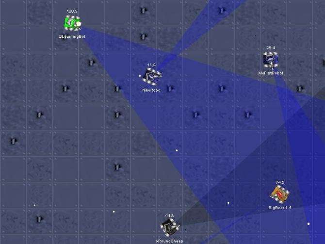
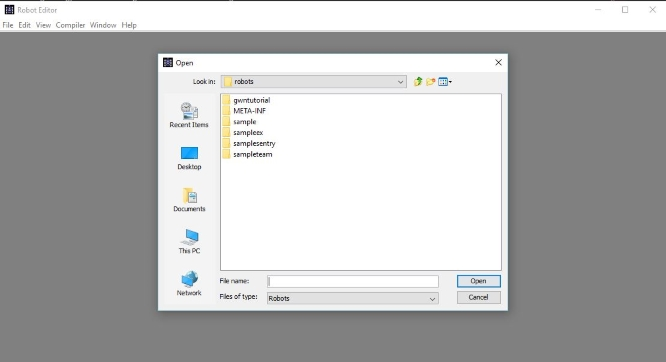

# Lesson 2: Robocode Lesson Plan

### Pre-flight instructions:
* If you haven't already downloaded the GWN projects folder, [click this link to download the GWN Projects folder.](https://github.com/CptMonac/Fex2016_Projects/archive/master.zip) Unzip this folder and save it to desktop.
* Go to the `Lesson_2` folder inside the unzipped folder. The folder will contain all the files you need for the Robocode lesson.
* Lesson overview:
  * `Intro to Robocode` : 10 min
	* `Robot Movement Tutorial` : 10 - 15 min
  * `Creating your own champion bot` : 45 min
  * `Recap` : 10 - 15 min

### Intro to Robocode

*Courtesy of lai18.com*

Robocode is a programming game where the goal is to code a robot to compete against other robots in a battle arena. The player is the programmer of the robot who has no direct influence over the game. Instead, the player must write the Artificial Intelligence (AI) of the robot telling it how to behave and react.

>A robot consists of three individual parts: the `tank body`, `the gun`, and `the radar`

>The `tank body` carries the gun and the radar on top. It is used for moving the robot forward and back, and turning left or right.

>The `gun` is mounted on the body and is used for firing energy bullets. The gun can turn left or right.

>The `radar` is mounted on the gun and is used to scan for other robots while you're moving. The radar can turn left or right.

Let's demo a robot battle to see what gameplay looks like:
  
*Loading a robot into the battlefield*

> 1. In the `RoboCode` folder, double-click the `robocode.bat` file
> 2. Click the `Battle` menu, then select `New`
> 3. In the `packages` column, select `sample`. Then pick the `sample.Tracker` `sample.SpinBot`, and `sample.Fire` robots from the `Robots` column and press the `Add` button.
> 4. Press the `Start battle` button.
> 5. Once the battle is finished, you can close the Robocode window.

RoboCode provides a robot editor that allows us to create new robots or modify robots that already exist. In this lesson we will be modifying the GWN sample robot already provided. Let's load it into Robocode and take a look:

*Loading a robot into the robot editor*
> 1. In the `Robocode` folder, double-click the `robocode.bat` file.
> 2. Click the `Robot` menu, then select `Source Editor`.
> 3. A new window called `Robot Editor` should open. This is where you get to create new robots and modify existing ones.
> 4. In the `Robot Editor` window, click `File` then `Open`
> 5. Navigate to the `robots` folder under the GWN Projects folder. Then click the `gwntutorial` folder.
> 6. Open the `MoveTutorial.java` file.
> 7. There should be some sample code in the editor now.

### Robot Movement Tutorial
In this lesson, you'll be learning how to move the sample robot you opened. [Here's a preview of what you'll be creating](readmeFiles/movementTutorial.gif).

Creating a robot can be easy, making your robot a winner is not :). Writing a robot can be addictive. Once you get going, you'll watch your creation as it goes through growing pains, making mistakes and missing critical shots. As you learn, you'll be able to teach your robot how to act and what to do, where to go and who to avoid.

**Pre-lesson prep**
* Follow the numbered instructions below in order. After you have completed a numbered instruction, save your code (`Ctrl + s`), and then compile it (`Ctrl + b`). You can add your robot to the battlefield after every save to see what you've just changed.
* Switch with your partner after you've verified your changes on the battlefield.
* In Java, lines must end with a semi-colon. Don't forget to add one at the end of each line.
* In Java, functions are case-sensitive, make sure you are typing a function name exactly as it looks in the reference.

**How to test your robot on the battlefield**
1. If you don't have the Robocode program already open, double-click the `robocode.bat` file in the `Robocode` folder.
2. Click the `Battle` menu, then select `New`
3. Under the `Packages` column, select `gwntutorial`. You should now see the list of GWN robots in the `Robots` column on the right.
4. Pick the robot you're working on from the left (e.g. `MoveTutorial`) and press `Add` button.
5. Press the `Start Battle` button.
6. A dialog box will pop up telling you you've only selected one robot. If you're just testing, hit `Yes` and continue. Otherwise, hit `No` and select another robot to battle against.

#### #1: Robot colors
Let's set the colors for the GWN sample robot.

**In the `run()` function, set the GWN sample robot to have the following properties: `black body`, `yellow gun`, `blue radar`, `white bullets`, and `red radar-scans`.**

>*Reference: `run()`*  
*The `run` function is the function that tells your robot what to do, and how to dress.*

---
>*Reference: `setColors(<body color>, <gun color>, <radar color>, <bullet color>, <radar-scan color>)`*  
*This function sets the colors for your robot's body, gun, radar, bullets, and radar-scans.*

> *Example: `setColors(orange, red, yellow, blue, pink)` -> orange body, red gun, yellow radar, blue bullets, pink radar-scans.*

#### #2: Right-turns
**In the `while()` function, turn your robot right by 90 degrees.**

>*Reference: `while()`*  
*The `while(true)` allows the `run` function to run repeatedly. Code that is not included inside the `while` function would only run once, not continuously.*

---
>*Reference: `turnRight(<no. of degrees>)`*  
*This function turns the robot right by the number of degrees you specify.*

> *Example: `turnRight(12)` -> turn the robot right by 12 degrees*

#### #3: Move forward
**In the `while()` function, move your robot forward by 100 pixels. A pixel is the unit of measurement in the battlefield.**

>*Reference: `ahead(<no. of pixels>)`*  
*This function moves the robot ahead by the number of pixels you specify.*

> *Example: `ahead(500)` -> move the robot forward by 500 pixels*

#### #4: Move backward
**In the `while()` function, move your robot backward by 100 pixels.**

>*Reference: `back(<no. of pixels>)`*  
*This function moves the robot backward by the number of pixels you specify..*

> *Example: `back(500)` -> move the robot backward by 500 pixels*

#### #5: Left-turns
**In the `while()` function, turn your robot left by 180 degrees.**

>*Reference: `turnLeft(<no. of degrees>)`*  
*This function turns your robot left by the number of degrees you specify.*

> *Example: `turnleft(12)` -> turns the robot left by 12 degrees*

### Create your own champion bot

*Robots competing on the battlefield*

In this lesson, you'll learn how to use the robot radar and gun to make your robot a champion in the battlefield. You will create a robot that will be able to compete with the sample robots already provided in Robocode.

In the Robocode game, angles increase in a clockwise direction starting from "North".

**Open the champion bot file in the Robocode editor**
> 1. In the `Robocode` folder, double-click the `robocode.bat` file.
> 2. Click the `Robot` menu, then select `Source Editor`.
> 3. A new window called `Robot Editor` should open. This is where you get to create new robots and modify existing ones.
> 4. In the `Robot Editor` window, click `File` then `Open`
> 5. Navigate to the `robots` folder under the GWN Projects folder. Then click the `gwntutorial` folder.
> 6. Open the `championbot.java` file.
> 7. There should be some sample code in the editor now.

**Pre-lesson prep**
* Follow the numbered instructions below in order. After you have completed a numbered instruction, save your code (`Ctrl + s`), and then compile it (`Ctrl + b`). You can add your robot to the battlefield after every save to see what you've just changed.
* Switch with your partner after you've verified your changes on the battlefield.
* In Java, lines must end with a semi-colon. Don't forget to add one at the end of each line.
* In Java, functions are case-sensitive, make sure you are typing a function name exactly as it looks in the reference.

**How to test your robot on the battlefield**
1. If you don't have the Robocode program already open, double-click the `robocode.bat` file in the Robocode folder
2. Click the `Battle` menu, then select `New`
3. Under the `Packages` column, select `gwntutorial`. You should now see the list of GWN robots in the `Robots` column on the right.
4. Pick the robot you're working on from the left (e.g. `championbot`) and press `Add` button.
5. Pick another robot you want to battle against. (e.g. `sample.Fire`) and press `Add` button.
6. Press the `Start Battle` button.

#### #1: Robot colors
The champion robot is a little different from the sample robot you practiced on. It sets its colors in a slightly different manner from what you did before.

**In the run() function, set champion bot to have the following properties: blue body, orange gun, black radar, green bullets, and red radar-scans**

>*Reference: `setColors(Color.<body color>, Color.<gun color>, Color.<radar color>, Color.<bullet color>, Color.<radar-scan color>)`*  
*This function sets the colors for your robot's body, gun, radar, bullets, and radar-scans.*

> *Example: `setColors(Color.orange, Color.red, Color.yellow, Color.blue, Color.pink)` -> orange body, red gun, yellow radar, blue bullets, pink radar-scans.*

#### #2: Radar scans
**In the `while()` function, move the radar in a 360 degree scan around your robot.**

>*Reference: `turnRadarRight(<no. of degrees>)`*  
*This function turns the radar to the right by the number of degrees you specify.*

> *Example: `turnRadarRight(20)` -> Move the radar in a 20 degree scan around the robot*

#### #3: Radar Lock
Let's lock the radar to any enemy it finds, so the robot doesn't have to keep scanning. This instruction will be broken up into multiple sections:

a. **Go to the `onScannedRobot()` function. Create a variable called `enemyRadarAngle`, and store the enemy robot angle in this variable.**

>*Reference: `onScannedRobot()`*  
*The `onScannedRobot(ScannedRobotEvent enemyRobot)` function tells your robot what to do when the radar sees another robot.*

---
>*Reference: `getEnemyRadarHeading(enemyRobot)`*  
*This function returns the angle that the radar should turn to lock onto the enemy robot you specify.*

> *Example: `getEnemyRadarHeading(enemyRobot)` -> returns 10 degrees to lock onto enemyRobot*

---
>*Reference: `variables`*  
>*You can create variables to store objects and numbers you
want to use later. One of the ways you can store numbers in Java is to create a variable that is of the type `double`.*  

> *Example: `double scimitar = getEnemyRadarHeading(enemyRobot)` -> Creates a variable called scimitar and store the angle of the enemy robot inside.*

b. **Turn the radar to face the angle that the enemy robot was spotted. This will be the angle in your `enemyRadarAngle` variable above.**

>*Reference: `turnRadarRight(<no. of degrees>)`*  
*This function turns the radar to the right by the number of degrees you specify.*

> *Example: `turnRadarRight(scimitar)` -> Move the radar to the angle stored in the scimitar variable*

#### #4: Gun Lock
Let's lock the gun of the robot to the enemy robot's location. Otherwise, the robot will shoot in the wrong direction. This instruction will be broken up into multiple sections:

a. **Go to the `onScannedRobot()` function. Create a new variable called `enemyGunAngle`, and store the angle to lock the robot gun to the enemy robot in this variable.**

>*Reference: `getEnemyGunHeading(enemyRobot)`*  
*This function returns the angle that the gun should turn to face the enemy robot you specify.*

> *Example: `double cross = getEnemyGunHeading(enemyRobot)` -> Creates a variable called cross and stores the angle to turn the robot gun inside.*

b. **Turn the robot gun to face the angle that the enemy robot was spotted. This will be the angle in your `enemyGunAngle` variable above.**

>*Reference: `turnGunRight(<no. of degrees>)`*  
*This function turns the gun to the right by the number of degrees you specify.*

> *Example: `turnGunRight(cross)` -> Turn the gun to the angle stored in the cross variable*

#### #5: Fire bullets
**In the `onScannedRobot()` function, fire an energy bullet of power 2 at the enemy robot.**

>*Reference: `fire(<power>)`*  
*This function will immediately fire a bullet with power equal to the number you specify in the direction the gun is pointing. You can only specify a number between 1 and 3. The higher numbers you specify, the longer the gun takes to recharge before it can fire again.*

> *Example: `fire(1)` -> fires a bullet with power 1 at the enemy robot*

#### #6: React to enemy bullets
By now, you've probably seen in the simulations, that the champion bot doesn't do much if it's been hit by an enemy bullet. Let's fix that.

**Go to the `onHitByBullet()` function. If the robot is hit by a bullet, tell it to do the following: Turn right by 45 degrees, Move ahead by 60px.**

>*Reference: `onHitByBullet()`*  
*The `onHitByBullet(HitByBulletEvent bulletEvent)` function tells your robot what to do when it's hit by a bullet.*

---
>*Reference: `turnRight(<no. of degrees>)`*  
*This function turns the robot right by the number of degrees you specify.*

> *Example: `turnRight(12)` -> turn the robot right by 12 degrees*

---
>*Reference: `ahead(<no. of pixels>)`*  
*This function moves the robot ahead by the number of pixels you specify.*

> *Example: `ahead(500)` -> move the robot ahead by 500 pixels*

#### #7: React to walls
The championbot doesn't really do much when it runs into walls. Let's fix that.

**Go to the `onHitWall()` function. If the robot hits a wall, tell it to do the following: Turn left by 20 degrees, Move back by 10px.**

>*Reference: `onHitWall()`*  
*The `onHitWall(HitWallEvent wallEvent)` function tells your robot what to do when it  hits a wall.*

---
>*Reference: `turnLeft(<no. of degrees>)`*  
*This function turns the robot left by the number of degrees you specify.*

> *Example: `turnLeft(80)` -> turn the robot right by 80 degrees*

---
>*Reference: `back(<no. of pixels>)`*  
*This function moves the robot ahead by the number of pixels you specify.*

> *Example: `back(500)` -> move the robot backward by 500 pixels*

#### #8: Congratulations!
Congratulations!! You have completed the lesson. You can continue modifying your robot to compete against the other sample robots if you like.

**Bonus**  
Currently, the championbot is pretty stationary and only moves if it's hit by a bullet. This makes the robot a very easy target for other robots. Consider implementing any of the following counter strategies:

* Move the championbot in a straight line in the battlefield while it's scanning.
* Move the championbot in a circle while it's scanning.
* Move the championbot backwards and forwards in an oscillating motion while it's scanning.
* Move the robot in a random direction while it's scanning.
