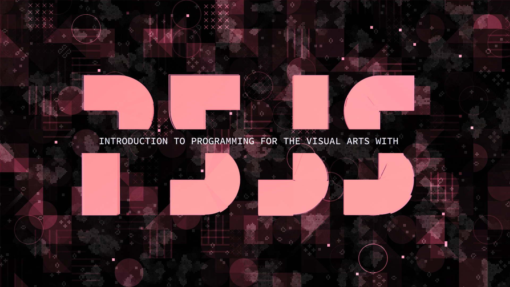
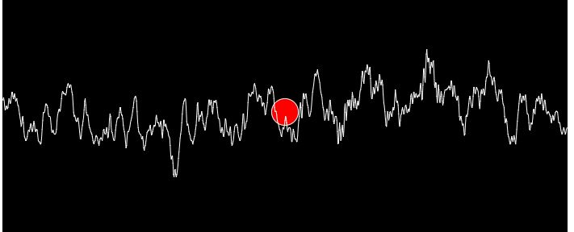

# Lesson 3: Music Visualizer Lesson Plan

### Pre-flight instructions:

* If you haven't already downloaded the GWN projects folder, [click this link to download the GWN Projects folder.](https://github.com/CptMonac/Fex2016_Projects/archive/master.zip) Unzip this folder and save it to desktop.
* Go to the `Lesson_3` folder inside the GWN projects folder on your desktop and extract `p5-win.zip` to your desktop. This zip file contains the files for the p5.js library which we will be using to complete the lesson.
* Go to the `p5-win` folder you just extracted and double-click the `p5.exe` file. It should have a pink icon.
* When the p5.js editor launches, click on the gear icon on the top right, scroll to the `Show sidebar` option, then click `On`.
* Lesson overview:
  * `Intro to p5.js` : 5 min
  * `Intro Tutorial Sketch Program` : 10 - 15 min
  * `Music visualizer program` : 45 min
  * `Recap` : 15 min

### Intro to p5.js

*Image courtesy of NPR*

What does sound actually look like? [Watch the video from npr for a fascinating discovery.](http://www.npr.org/2014/04/09/300563606/what-does-sound-look-like)

> p5.js is a JavaScript library that aims to make coding accessible for artists, designers, educators, and beginners. It uses web technologies like HTML5 Canvas to make everything more interactive. You can use to add interactive sketches to your website. These can range from an image that changes when someone clicks it, to animations that users can interact with through web-cam. You can use p5.js for writing games or advanced applications, but it's best suited for smaller projects like an interactive logo, a little art piece, or an animated introduction to your website.

Let's run through an Introductory Tutorial to how p5.js works. Follow the instructions in the `Intro Tutorial Sketch` section below.

### Intro Tutorial Sketch Program

*Image courtesy of sahirkhan.com*

In this lesson we'll be using the p5.js library to draw basic shapes on the screen. [Here's a preview of what you'll be creating](http://cptmonac.me/Fex2016_Projects/Lesson_3/IntroTutorial.html).

Follow the numbered instructions below in order. After you have completed a numbered instruction, save your code, and switch with your partner.

In the p5 editor go to `File > Open`, then navigate to your GWN projects folder. Open `Lesson_3` and navigate to the `IntroTutorial` folder inside (`Fex2016_Projects/Lesson_3/IntroTutorial`).
Open the `sketch.js` file from the `IntroTutorial` folder.

Press the play button in the p5.js editor. You should see a small window pop up with nothing in it. This is the drawing canvas where we’ll be adding shapes and animations.

### #1: Canvas size
Let's make your drawing canvas bigger. By default, the drawing canvas has a size of 100 pixels by 100 pixels. Don't forget to press play after you changes to see the bigger canvas.

**Change the canvas size to 400 pixels by 400 pixels in the setup function.**

>*Reference: `setup()`*  
*The setup function runs once, and is used for setting things up. It's also used for creating a program that does not need a loop running code repeatedly. The setup function is usually created by default for every p5.js sketch.*

---
>*Reference: `createCanvas(<canvas width>, <canvas height>)`*  
*This function creates a canvas of the width and height you specify.*

> *Example: `createCanvas(200, 200)` -> creates a canvas 200px high and wide.*

### #2: Background Color
Let's add a background color to the canvas.

**Add a gray background to the canvas in the setup function.**

> *Reference: `background(<number>)`*  
*This function sets the color used for the background of the canvas. It allows you to specify a value between black and white. 0 is black, 255 is white.*

> *Example: `background(0)` -> draws a black background on the canvas.*

### #3: Ellipses
Let’s draw an ellipse on the canvas.

**Draw an ellipse using the ellipse function in the setup function.**

> *Reference: `ellipse(x-coordinate, y-coordinate, width, height)`*  
*This function draws an ellipse (oval) to the screen. The first two parameters set the location, and the last two parameters set the width and height of the ellipse.*

> *Example: `ellipse(20, 40, 80, 50)` -> creates an oval at (20,40) that is 80px wide and 50px high.*

### #4: Lines
Let’s draw a line on the canvas.

**Draw a line using the line function in the setup function.**

>*Reference: `line(start x-coordinate, start y-coordinate, end x-coordinate, end y-coordinate)`*  
*This function draws a line between two points on the canvas.*

>*Example:    `line(10, 10, 30, 30)` -> creates a line between (10,10) and (30, 30)*

### #5: Animation
Let’s animate an ellipse moving across the canvas. This instruction will be broken up into multiple sections:

a. Let’s create a variable that can store numbers.  
**Create a variable called `position` and give it a value of 0. Make sure to place the variable before the `setup` function.**

>*Reference example: You can create variables to store numbers you want to use later.*  
>*`var center = 10` -> Create a variable called 'center' and to store the value of 10 in it.*

b. **Draw an ellipse on the canvas in the draw function.
Use the 'position' variable you created above as the x-coordinate of the ellipse. The y-coordinate should be 50 pixels. The width and height should be 20 pixels.**

>*Reference: `draw()`*

>*The draw function runs repeatedly in a loop and is typically used for animation.*

---
>*Reference: `ellipse(x-coordinate, y-coordinate, width, height)`*  
*This function draws an ellipse (oval) to the screen. The first two parameters set the location, and the last two parameters set the width and height of the ellipse.*

>*Example:   `ellipse(center, 40, 80, 50)` -> creates an oval at (10,40) that is 80px wide and 50px high. The `center` variable was created above with the value of 10*

c. Let’s animate your ellipse by moving it across the canvas.

**Add the number 1 to the `position` variable. The `position` variable will get bigger every time the draw function is run and move the ellipse across the screen.**

>*Reference example: You can add numbers to variables and store them for later use.*   
>*`center = center + 10` -> Adds ten to the 'center'' variable every time it’s called.*

### Music Visualizer Sketch Program

In this lesson we’ll be using the p5.js library to display visuals in real-time for a song-file. [Here’s a preview of what you’ll be creating.](http://cptmonac.me/Fex2016_Projects/Lesson_3/MusicVisualization.html)

Follow the numbered instructions below in order. After you have completed a numbered instruction, save your code, and switch with your partner.

In the p5 editor go to `File > Open`, then navigate to your GWN projects folder. Open `Lesson_3` and navigate to the `MusicVisualizer` folder inside (`Fex2016_Projects/Lesson_3/MusicVisualizer`).
Open the `sketch.js` file from the `MusicVisualizer` folder.

Press the play button in the p5.js editor. You should see a window pop up with nothing in it. We will be loading songs and drawing shapes onto this drawing canvas.

### #1: Load songs
Let's load a song onto the canvas. This instruction will be broken up into multiple sections:

a. Let’s create a variable that we’ll use to store the song.

**Create a variable called `song`. Make sure to place it before the `preload` function.**

> *Reference: `preload()`*  
*The `preload` function allows you to load files and objects into the canvas before the `setup` function is called. We will be using this function to load our songs before the ‘setup’ function is called.*

---
> *Reference example: You can create variables to store objects you want to use later.   
`var center` -> Create a variable called ‘center’*

b. Let’s load a song you can play into the canvas. There are two songs currently in the `assets` folder on the left of the editor.

**Load the `Mungopark` song from the assets folder into your `song` variable. Load the song in the `preload` function.**

>*Reference: `loadSound(‘<enter your mp3 filename path>’)`*  
*This function loads the specified file and returns a sound object that can be used around the canvas.*

>*Example: `center = loadSound(‘assets/example.mp3’)` -> loads the ‘example.mp3’ song into the center variable.*

c. Let’s play the song you loaded into the canvas.

**Play the song that was loaded into the `song` variable. Make sure to call the `play()` function from within the `setup` function.**

>*`Reference: play()`*  
*This function plays the song that is contained in a sound object.*

>*Example: `center.play()` -> plays the ‘example.mp3’ song that was loaded into the center variable.*

### #2: Background
Let's add a background to the canvas.

**Draw a black background for the canvas in the `draw` function.**
> *Reference: `background(<number>)`*  
*This function sets the color used for the background of the canvas. It allows you to specify a value between black and white. 0 is black, 255 is white.*

>*Example: `background(255)`-> draws a white background on the canvas*

### #3: Add shapes
Let's add shapes to the canvas.

**Draw a 100px wide circle on the canvas. Make sure the circle is centered in the canvas (the canvas size is currently 700px wide by 700px high).**

>*`Reference: ellipse(<x-coordinate>, <y-coordinate>, <width>, <height>)`*  
*This function draws an ellipse (oval) to the screen. The first two parameters set the location, and the last two parameters set the width and height of the ellipse.*

>*Example: `ellipse(0, 40, 80, 80)` -> creates a circle at (0,40) that is 80px wide and 80px high.*

### #4: Colors
**Color your circle red. Make sure to call the `fill` function before you draw the circle, you can’t color a circle after you’ve already drawn it to the canvas.**

>*Reference: `fill(<red value>, <green value>, <blue value>)`*  
*Computers can generate any color using combinations of red, green and blue values. The fill function sets the color that will be used to fill shapes. The values for each of the red, green, or blue parameters must be between 0 and 255.*

>*Example: `fill(0, 0, 255)` -> will fill shapes with the color blue.*

### #5: Random
**Modify the `fill` function to draw the circle with a random shade of red each time it’s drawn.**

>*Reference: `random(<number>)`*  
*This function will give you a random number between 0 and the number you enter.*

>*Example: `random(500)` -> gives a random number between 0 and 500 each time it’s called.*

### #6: Animations
Let’s change the size of the circle according to how loud the song is. This should simulate a boombox effect. This instruction will be broken up into multiple sections:

a. **Create a variable called `volume`. Make sure to place it before the `preload` function. We’ll use this variable to store the volume of the song.**

>*Reference example: You can create variables to store objects you
want to use later.   
`var center` -> Creates a variable called ‘center’*

b. **Create a variable called `diameter` and give it a value of 100. Make sure to place it before the `preload` function. We’ll use this variable to store the width of the circle you’re going to draw.**

c. Store the current volume of your song in the `volume` variable you created earlier.

>*Reference: getVolume()*  
*This function returns the current volume of the song that is playing.*

>*Example: `Center = getVolume()` -> Gets the volume of the song that is currently playing and stores it in the center variable.*

d. Multiply the `diameter` variable with the `volume` variable and store the result in the `volume` variable.
>Reference example: Multiplication in p5.js is done using the multiplication symbol `*`.  
`center = 15 * center ->` multiply the center variable by 15 and store the result in center.

e. **Delete the ellipse function in the `draw` function from above.
Draw a new circle with the `volume` variable as the height and width of the circle. Make sure the circle is centered on the canvas.**

>*Reference: `ellipse(<x-coordinate>, <y-coordinate>, <width>, <height>)`*  
*This function draws an ellipse (oval) to the screen. The first two parameters set the location, and the last two parameters set the width and height of the ellipse.*

>*Example: `ellipse(0, 40, center, center)` -> creates a circle at (0,40) that uses the center variable for width and height*

### #7: Waveform
For the final piece, we will display a waveform of the song, so you can see it as it plays in real-time. This instruction will be broken up into multiple sections:

a. **Get the waveform for the song and store this waveform in a new variable called `samples`. Place the variable inside the `draw` function.**

>*Reference: `getWaveform()`*  
*This function returns the waveform of the song that is playing.*

>*Example: `var markers = getWaveform()` -> creates a variable called markers and stores the waveform for the song that is playing inside.*

b. **Draw the waveform to the canvas**

>*Reference: `drawWaveform(<input waveform>)`*  
*This function draws the waveform for the song that is given as input.*

>*Example: `drawWaveform(markers)` -> draws the waveform for the markers variable from the example above.*

### #8: Congratulations!!!
You have created a program that can visualize any song file you give it.  
You can try changing the song to see a different visualization or tweaking different parameters to create a different visualization.
